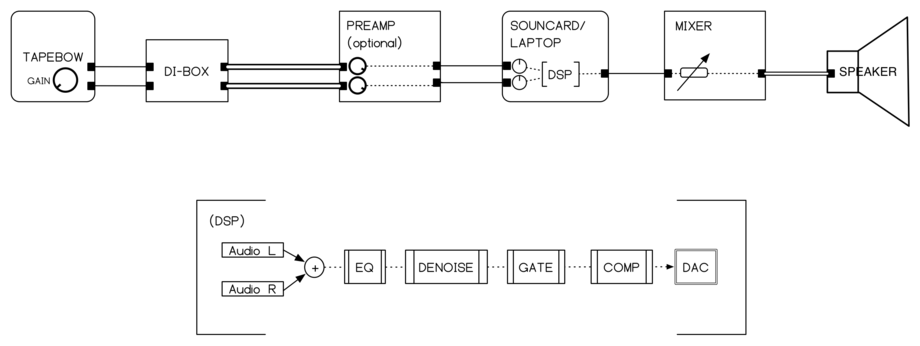
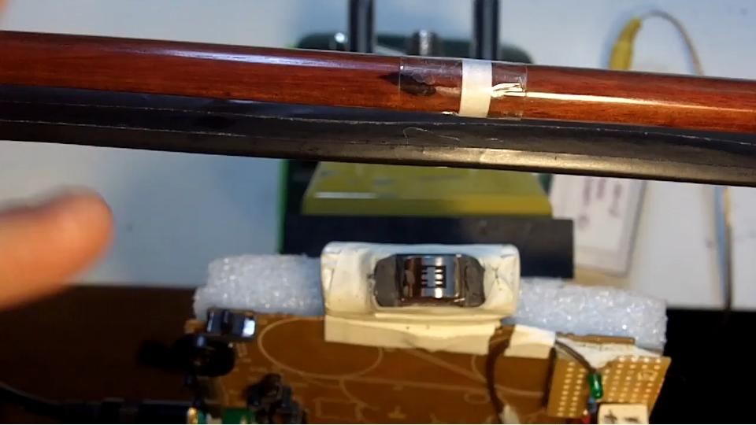

# Signal

The signal path, to be read from top to bottom

    tapebow (stereo) x 3
    DI-Box (stereo) x 3
    Mixer
    Computer (6 in, 3 Out)
    Mixer
    Loudspeaker x 3 (one loudspeaker per player, placed direct behind each player
    so that the signal is also audible by the player)
    

# Tapebow

[Video Demonstration](https://vimeo.com/96349330)

A tapebow is simply a tape player (a walkman in most cases) in which the
playhead has been mounted on a mute to be played by the bow. The bow-hair
has been replaced by magnetic tape, with both channels containing the same
audio material. The output of a tapebow is stereo!

# Noise Reduction / Volume Pedal

The tapebow's signal is very noisy. For this, an active form of noise-reduction is 
used. A recommended way is to use a plugin which can take a snapshot of the noise
profile and use this as a filter. One such plugin is implemented in REAPER

* Install REAPER (any version) (http://www.reaper.fm/download.php)
* Install the plugins under folder "noisereduction/plugins" for your operating system
* Open the REAPER session noisereduction/(the file ending in .RPP)
* Connect three expression pedals

# Keyboard

## Requirements

* A keyboard with at least 61 keys
* An expression pedal
* A sustain pedal
* A computer running linux, with an audio-interface (2 out)
* A keyboard amplifier

## Installation

For Ubuntu >= 18.04:

    $ cd midikeyb
    $ ./install-ubuntu.sh
    
This will install all dependencies (csound, puredata for the gui, liblo for OSC)

## Usage

We assume that the system is configured to use jack

1. Connect the keyboard, with an expression and a sustain pedal connected
2. Start jack
3. Connect the audio to the amplifier
4. At the terminal (in the `midikeyb` folder)

    $ ./zaehmungenkeyb.py
    
* This will start the csound-engine and a puredata patch for the gui 
* Puredata is only used for gui (no audio)

5. Configure midi
   * With the patch running, click on "CONFIG"
   * This should open the configuration file in a suitable text editor 
   * Otherwise, open the file `~/.zaehmungen/userconfig.json`
   * Modify the value for CC_gainchange to match the CC sent by the expression pedal
   * Modify the value for CC_sustain to match the CC sent by the sustain pedal
   * "volpedal_curve" is an exponential factor applied to the midi values to change 
     the mapping between midi and dB gain. 
6. Other customizations:
   * RANDOM: this changes the randomness of the grains distribution
   * COMPRESS: how much to compress audio. Adjust gain accordingly (`MAX_DB`, `MIN_DB`)
